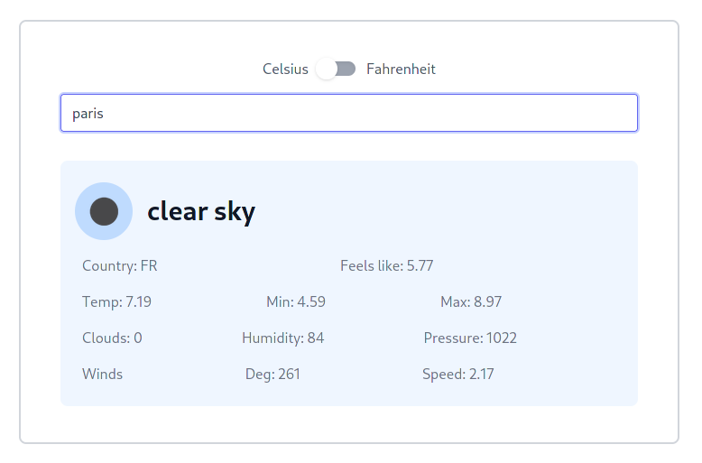

## JavaScript: Weather App

A sample Weather App implimentation in JS using webpack. You can find the original project specification at: [The Odin Project](https://www.theodinproject.com/courses/javascript/lessons/weather-app)

### Screenshot

### Built With

* [HTML5](https://en.wikipedia.org/wiki/HTML5)
* [TailwindCSS](https://tailwindcss.com/)
* [SASS(SCSS)](https://sass-lang.com/)
* [Styleint](https://stylelint.io/)
* [JavaScript](https://en.wikipedia.org/wiki/JavaScript)
* [Npm](https://www.npmjs.com/)
* [Webpack](https://webpack.js.org/)
* [ESLint](https://eslint.org/)

### Live Demo

[Live Demo Link](https://bashforger.github.io/weather-app-js/)

### Getting Started

To get a local copy up and running follow these simple example steps.

1. On the project GitHub page, navigate to the main page of the repository.
2. Under the repository name, locate and click on a green button named `Code`.
3. Copy the project URL as displayed.
4. If you're running the Windows Operating System, open your command prompt. On Linux, Open your terminal.
5. Change the current working directory to the location where you want the cloned directory to be made. Leave as it is if the current location is where you want the project to be.
6. Type git clone, and then paste the URL you copied in Step 3.  
e.g. $ `git clone https://github.com/bashforger/weather-app-js.git`
7. Press Enter. Your local copy will be created.
8. Run `npm install`. If you do not have `npm` installed you can get it from [here](https://www.npmjs.com/).
9. Run `npm run build` to build production version of project.
10. Open `index.html` in `dist` directory for production version or Run `npm start` to run development version

### Author

👤 **Muhammad Adeel Danish**

- GitHub: [@bashforger](https://github.com/bashforger)
- LinkedIn: [LinkedIn](https://www.linkedin.com/in/muhammad-adeel-danish/)
- Twitter [@bashforge](https://twitter.com/bashForge)

### Contributing

Contributions, issues, and feature requests are welcome!
Feel free to check the [issues page](../../issues).

1. Fork the Project
2. Create your Feature Branch (`git checkout -b feature/AmazingFeature`)
3. Commit your Changes (`git commit -m 'Add some AmazingFeature'`)
4. Push to the Branch (`git push origin feature/AmazingFeature`)
5. Open a Pull Request

### Show your support

Give a ⭐️ if you like this project!

### License

This project is [MIT](./LICENSE) licensed.

